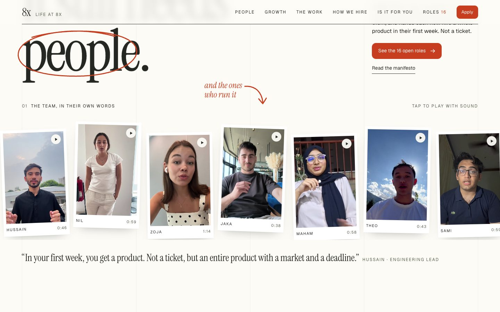
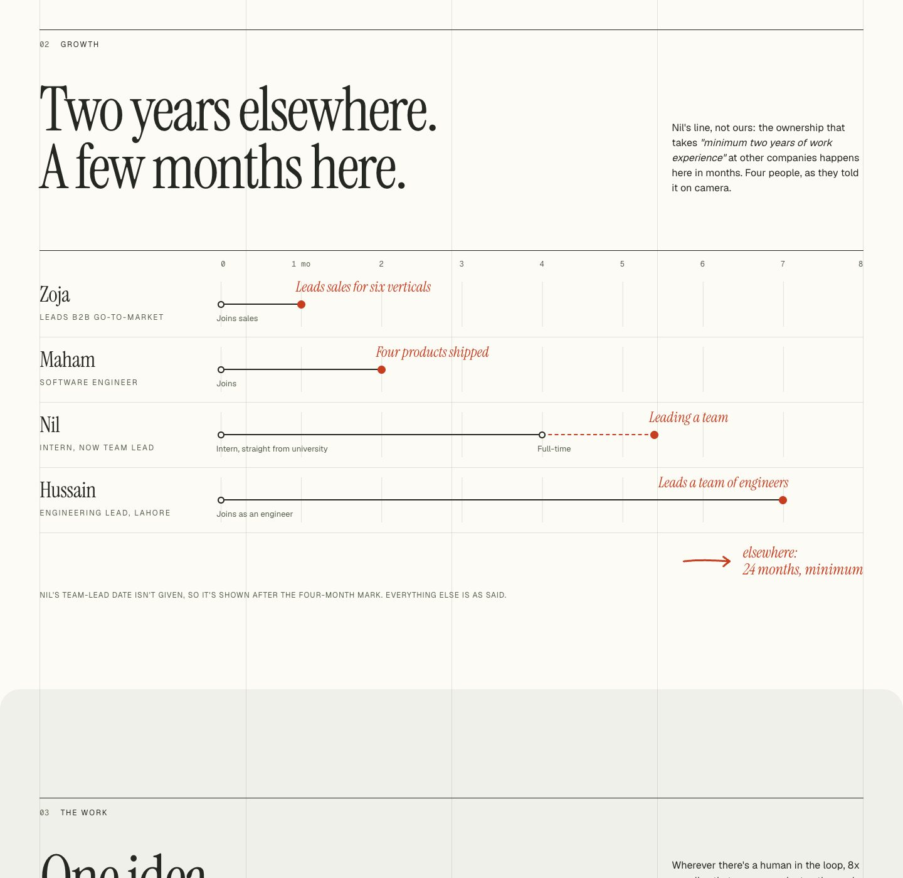
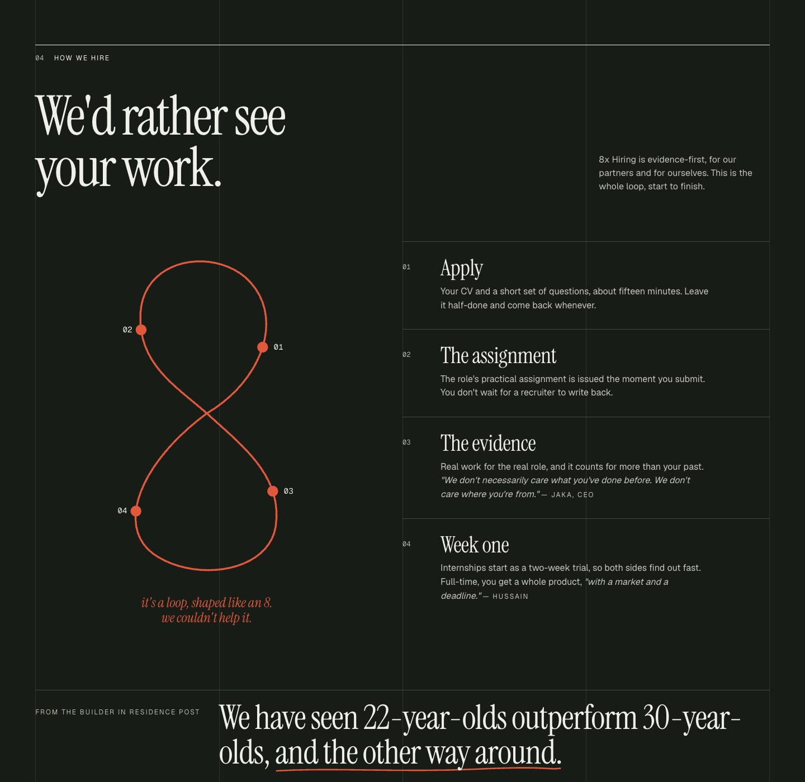
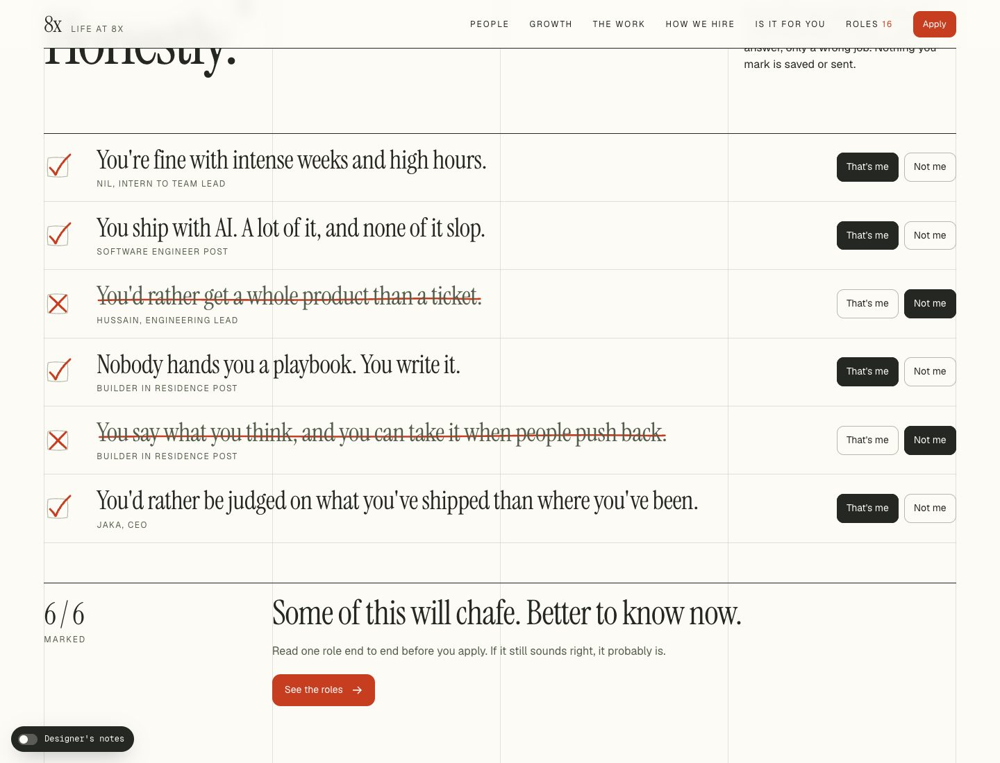
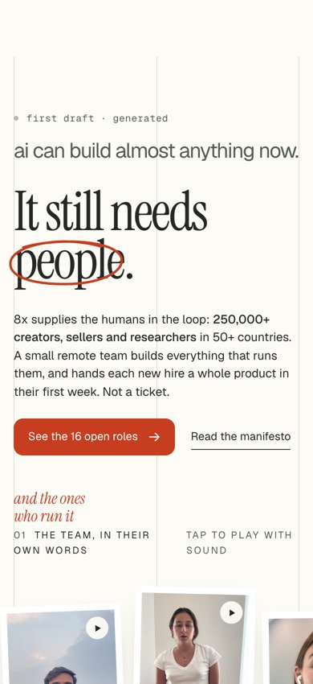

# Life at 8x: a redesign of 8x.life

**Live: [8xbykaleem.vercel.app](https://8xbykaleem.vercel.app/)**

A concept redesign of [8x.life](https://8x.life/), 8x's life-at-the-company site, in the style of [e2.vc](https://e2.vc/). The site's job is to make the right people want to work at 8x and give the wrong people a reason to opt out. The original did neither: it was written for buyers, and its best recruiting material was buried on another domain.

> Not affiliated with or endorsed by 8x. Team footage, names and quotes are 8x's own public material (from [8x.careers](https://www.8x.careers/)), used here to redesign their site for them.



## What was wrong

The original homepage is one screen: a tagline for clients ("Human orchestration for business outcomes"), a list of product domains, and a small grey "Jobs" link that leaves the site. A candidate comes away knowing almost nothing about working there.

Meanwhile, one domain away on 8x.careers:

- **Eleven team members on video**, hidden behind hover states on every job post. The life site showed two names and no faces.
- **The hiring process:** the practical assignment arrives the moment you apply. That's 8x's most distinctive trait, and the real self-selection filter, and the life site never mentioned it.
- **The actual pitch**, inside those clips: intern to team lead, sales to six verticals in a month, engineer to lead in seven months.

The full audit, including the e2.vc teardown and what I chose to leave behind, is in [`research/RESEARCH.md`](research/RESEARCH.md).

## The idea

8x's own design system (from 8x.careers) already has two typefaces. I gave each one a job:

- **Geist is the machine.** It sets the draft, the data and the grid.
- **Instrument Serif is the human.** It sets the voice and the judgement.
- **Vermilion is the human hand**, and it's used only for marks: circles, arrows, strike-throughs.

That's 8x's thesis, the human in the loop, expressed in its own tokens. From e2.vc I took the visible grid, the restraint (two surfaces, one accent), prints tilted a couple of degrees, and a headline that states the thesis. I left behind e2's weight (6.7 MB), its scroll-pinned dead space on mobile, and its physics toy.

| | |
|---|---|
|  |  |
| **Growth:** career velocity, charted only from what people said on camera | **How we hire:** the loop, drawn as an 8 as you scroll |
|  |  |
| **Is it for you:** the visitor makes the marks and gets an honest verdict | **Mobile first:** 8x hires interns across SE Asia, LATAM, Japan and Poland |

## What's in the repo

```
site/                 the build: static HTML, CSS and JS, no framework (~75 KB of its own code)
DESIGN-NOTES.md       section-by-section reasoning: what was wrong, what changed, why
research/RESEARCH.md  the audit of 8x.life and the teardown of e2.vc
research/captures/    screenshots and design-token dumps of both sites, desktop and mobile
research/transcripts/ transcripts of the 11 team clips (source of every quote on the page)
research/tools/       the scripts used to capture, measure and transcribe
concept/              the first hero sketch
```

## Run it

It's a static site. Open `site/index.html`, or serve the folder:

```bash
npx serve site
```

Team videos stream from 8x's own CDN when tapped; nothing else loads from outside except Google Fonts.

## Accuracy

Every fact on the page comes from 8x's sites or the team's own clips. Quotes are lightly cleaned from the transcripts, never reworded. Where 8x.careers leaves a role's location or type blank, the page shows "—" rather than a guess.
